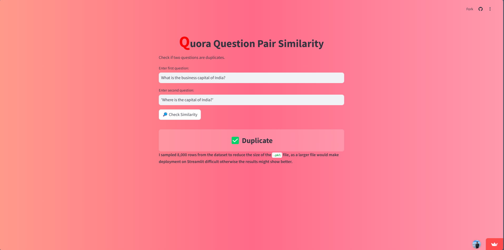

# 📌 Question Pair Similarity Classification

## **Introduction**  
The goal of this project is to develop an advanced question pair similarity classification system that leverages text preprocessing, exploratory data analysis, and machine learning techniques to accurately identify whether two questions are semantically similar (duplicates) or not.

---

## **📂 1. Reading the Dataset**  
The `train.csv` file contains **404,290 rows and 6 columns**. Training the model on the entire dataset would require significant computational time. To optimize the process, I **sampled 50,000 rows** from the dataset and set a **random state of 2**. This randomly selects a subset of **50,000 rows** from the dataset for faster processing.  
✅ To optimize performance, we **randomly selected 50,000 rows** for training.  

---

## **📊 2. Exploratory Data Analysis (EDA)**  
Before training the model, we analyzed the data:  
✅ **Checked how many duplicate questions exist.**  
✅ **Visualized word distributions using graphs.**  

---

## **🔍 3. Text Preprocessing Pipeline**  
✅ **Removing HTML tags**  
✅ **Removing Punctuations**  
✅ **Performing Lemmatization**  
✅ **Performing Lowercase**  
✅ **Removing Stopwords**  
✅ **Decontracting words**  
✅ **Replacing special characters with their string symbols**  

---

## **⚙️ 4. Feature Engineering**  
✅ **Adding some features: `q1_len`, `q2_len`, `q1_num_words`, `q2_num_words`, `word_common`, `word_share`**.  
✅ **Added token-based, length-based, and fuzzy features like:**  
  - `cwc_min`, `cwc_max`, `csc_min`, `csc_max`, `ctc_min`, `ctc_max`, `last_word_eq`, `first_word_eq`  
  - `abs_len_diff`, `mean_len`, `fuzz_ratio`, `fuzz_partial_ratio`, `token_sort_ratio`, `token_set_ratio`, `longest_substr_ratio`  
✅ **TF-IDF (Term Frequency-Inverse Document Frequency) vectorization** to convert the text questions into numerical features.  
✅ **We added extra features to help the model understand question similarities.**  

---

## **🤖 5. Model Building & Training**  

The dataset was split into:  
✅ **80% Training Data**  
✅ **20% Test Data**  

We tested multiple machine learning models:  
✅ **Logistic Regression**  
✅ **Random Forest**  
✅ **XGBoost (XGB)**  
✅ **Decision Tree**  
✅ **Artificial Neural Network (ANN) using Keras**  
✅ **LSTM for sequence-based learning**  

We also performed **Grid Search** for **hyperparameter tuning**.  

---

## **📈 6. Model Evaluation**  

| **Model**              | **Accuracy** | **F1-Score** |
|------------------------|-------------|--------------|
| Logistic Regression   | **76.24%**   | **66.42%**   |
| Random Forest        | **77.88%**   | **68.42%**   |
| XGB                  | **77.50%**   | **68.80%**   |
| ANN                  | **72.70%**   | **62.29%**   |
| Decision Tree        | **72.70%**   | **62.29%**   |

✅ **Random Forest performed the best**, achieving **77.88% accuracy**.  
✅ A **confusion matrix** was used to analyze model errors.  

---

## **🚀 7. Deployment**  
We deployed the model using **Streamlit**, allowing users to:  
✅ Enter **two questions**  
✅ Get a **similarity probability score**  

🔗 **Try the Web App:** [👉 Click Here](https://questionquora.streamlit.app/)  

  
